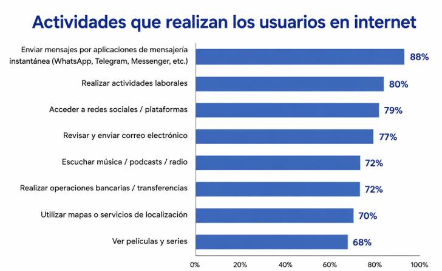

<!-- ===================================================== -->
<!-- PORTADA -->
<!-- ===================================================== -->

# Introduccion

<!-- ===================================================== -->
<!-- OBJETIVO -->
<!-- ===================================================== -->

## Objetivo

Al finalizar esta lección serás capaz de:

- Definir qué es un dato.
- Identificar los principales tipos de datos primitivos.
- Reconocer ejemplos de cada tipo de dato en situaciones cotidianas.

<!-- ===================================================== -->
<!-- PREGUNTA DETONADORA -->
<!-- ===================================================== -->

## Pregunta

*¿Qué tienen en común una fotografía, un mensaje de WhatsApp y la temperatura de una ciudad?*

<!-- ===================================================== -->
<!-- SUBTEMA 1 -->
<!-- ===================================================== -->

# ¿Qué son los datos?

<!-- ===================================================== -->
<!-- CONCEPTOS -->
<!-- ===================================================== -->

## Definición de datos

:::: {.columns}

::: {.column width="60%"}

Los datos son un conjunto de hechos, números, palabras, observaciones u otra información útil.
 A través del procesamiento de datos y análisis de datos, las organizaciones transforman datos sin procesar en *insights* valiosos que mejoran la toma de decisiones e impulsan mejores resultados comerciales. [@ibm_data_2026]

:::

::: {.column width="40%"}

{width=80%}

:::

::::

## Dicho de otra forma...

:::: {.columns}

::: {.column width="60%"}

Los datos son información que podemos almacenar, organizar y analizar para responder preguntas o tomar decisiones.

:::

::: {.column width="40%"}

{width=70%}

:::

::::

## ¿Quién genera datos?

{width=90%}

## ¿Quién genera datos?

La pregunta importante no es quién genera datos, sino quién no los genera.

::: {.fragment}

Empresas, gobiernos, hospitales, bancos, aplicaciones, videojuegos e incluso nosotros generamos datos constantemente.

:::

::: {.fragment}

Por ejemplo, cada día generamos datos de ubicación, mensajes, compras, música, navegación y redes sociales.

:::

::: {.fragment}

**Todos generan datos.**

:::

## ¿Quién genera datos?

Según un estudio realizado por el INEGI sobre los hábitos de usuarios de Internet en México durante 2024 [@inegi_habitos_internet_2024], las actividades que realizamos todos los días generan una enorme cantidad de datos.

## ¿Quién genera datos?

{width=100%}

## ¿Quién genera datos?

De hecho, esto dice Internet:

::: {.incremental}

- Google maneja cerca de **40,000 petabytes de datos diariamente**. [@google_data_2024]
- WhatsApp entrega alrededor de **100 billones de mensajes al día**. [@whatsapp_messages_2020]
- En TikTok se suben más de **23 millones de videos cada día**, es decir, aproximadamente **16,000 videos por minuto**.[@tiktok_statistics_2025] 

:::

## ¿Qué datos generan?

:::: {.columns}

::: {.column width="30%"}

{width=90%}

:::

::: {.column width="70%"}

::: {.incremental}

- Mensajes enviados
- Hora del mensaje
- Destinatario
- Archivos compartidos
- Llamadas realizadas
- Tiempo de conexión

:::

:::

::::

## ¿Qué datos generan?

:::: {.columns}

::: {.column width="50%"}

{width=90%}

:::

::: {.column width="50%"}

::: {.incremental}

- Películas y series reproducidas
- Tiempo de reproducción
- Búsquedas realizadas
- Calificaciones
- Listas personales
- Dispositivo utilizado

:::

:::

::::

## ¿Qué datos generan?

:::: {.columns}

::: {.column width="30%"}

{width=90%}

:::

::: {.column width="70%"}

::: {.incremental}

- Ubicación de origen y destino
- Tiempo del viaje
- Costo del viaje
- Conductor asignado
- Calificación del viaje
- Método de pago

:::

:::

::::

<!-- ===================================================== -->
<!-- IDEA CLAVE -->
<!-- ===================================================== -->

## Idea clave

Todos generamos datos... pero no todos los datos son iguales.

<!-- ===================================================== -->
<!-- SUBTEMA 2 -->
<!-- ===================================================== -->

# Tipos de datos

<!-- ===================================================== -->
<!-- CONCEPTOS -->
<!-- ===================================================== -->

## No todos los datos son iguales

Ya vimos que los organismos generan muchos datos y de muchos tipos:

::: {.incremental}
- **Numéricos**: precios, temperatura, edades, venta
- **Texto**: mensajes, correos, comentarios, búsquedas
- **Fecha y hora**: fechas de compra, horarios, duración, registros de acceso.
- **Ubicación**: GPS, rutas, direcciones
- **Imágenes**: fotografías, radiografías, publicaciones
- **Audio**: canciones, notas de voz, llamadas
- **Video**: películas, videollamadas, TikToks
:::

## Datos numéricos

Los **datos numéricos** representan cantidades que pueden medirse o contarse. Se utilizan para realizar operaciones matemáticas y análisis estadísticos.

::: {.incremental}

**Ejemplos:**

- Edad de una persona.
- Temperatura de una ciudad.
- Precio de un producto.
- Número de estudiantes.

:::

::: {.fragment}
::: {.real-example}

**Ejemplo real**

25 años · 18 °C · $350.00 · 12 km · 150 estudiantes

:::
:::

## Datos de texto

Los **datos de texto** representan información formada por letras, palabras, símbolos o frases. Se utilizan para describir, identificar o comunicar información.

::: {.incremental}

**Ejemplos:**

- Nombre de una persona.
- Dirección de correo electrónico.
- Comentario de un usuario.
- Mensaje de WhatsApp.

:::

::: {.fragment}
::: {.real-example}

**Ejemplo real**

"Denisse Urenda" · "ingenieria.datos@uacj.mx"

:::
:::

## Datos de fecha y hora

Los **datos de fecha y hora** representan momentos específicos en el tiempo. Se utilizan para registrar cuándo ocurre un evento y analizar su secuencia o duración.

::: {.incremental}

**Ejemplos:**

- Fecha de nacimiento.
- Hora de una compra.
- Fecha de un examen.
- Hora de inicio de una llamada.

:::

::: {.fragment}
::: {.real-example}

**Ejemplo real**

15/08/2026 · 08:30 a.m. · 2026-07-13 14:25:36 · 12:00 p.m.

:::
:::

## Datos de ubicación

Los **datos de ubicación** representan un lugar o una posición geográfica. Se utilizan para localizar personas, objetos o eventos.

::: {.incremental}

**Ejemplos:**

- Dirección de un domicilio.
- Coordenadas GPS.
- Ruta de un viaje.
- Ubicación de un restaurante.

:::

::: {.fragment}
::: {.real-example}

**Ejemplo real**

31.6904, -106.4245 · Av. Tecnológico 1340 · Ciudad Juárez, Chihuahua

:::
:::

## Datos de imagen

Los **datos de imagen** representan información visual capturada mediante fotografías, dibujos, radiografías o ilustraciones.

::: {.incremental}

**Ejemplos:**

- Fotografía.
- Radiografía.
- Imagen satelital.
- Captura de pantalla.

:::

::: {.fragment}
::: {.real-example}

**Ejemplo real**

📷 selfie.jpg · 🩻 radiografia.png · 🌎 satelite.tif

:::
:::

## Datos de audio

Los **datos de audio** representan sonidos o grabaciones que pueden almacenarse y reproducirse digitalmente.

::: {.incremental}

**Ejemplos:**

- Canción.
- Nota de voz.
- Llamada telefónica.
- Podcast.

:::

::: {.fragment}
::: {.real-example}

**Ejemplo real**

🎵 musica.mp3 · 🎙️ nota_de_voz.m4a · 📞 llamada.wav

:::
:::

## Datos de video

Los **datos de video** representan una secuencia de imágenes, generalmente acompañadas de audio, que permiten registrar o reproducir movimiento.

::: {.incremental}

**Ejemplos:**

- Película.
- Videollamada.
- Video de seguridad.
- TikTok.

:::

::: {.fragment}
::: {.real-example}

**Ejemplo real**

🎬 pelicula.mp4 · 📹 reunion.mp4 · 🎥 tiktok.mp4

:::
:::

<!-- ===================================================== -->
<!-- IDEA CLAVE -->
<!-- ===================================================== -->

## Idea clave

Los datos pueden representarse de muchas formas.

Y cada una requiere una manera distinta de almacenarse.

<!-- ===================================================== -->
<!-- RESUMEN -->
<!-- ===================================================== -->

# Resumen

- **Todos generamos datos** en nuestras actividades diarias.
- **Los datos pueden representar distintos tipos de información**, como números, texto, fechas, imágenes, audio, video o ubicaciones.
- **Identificar el tipo de dato es el primer paso** para almacenarlo, procesarlo y analizarlo correctamente.

<!-- ===================================================== -->
<!-- REFERENCIAS -->
<!-- ===================================================== -->

# Referencias

::: {#refs}
:::

# Pregunta

{width=50%}

<!-- ===================================================== -->
<!-- LABORATORIO -->
<!-- ===================================================== -->

# Laboratorio

En el laboratorio pondremos en práctica los conceptos vistos en esta lección mediante ejemplos y actividades guiadas.

[**Ir al Notebook →**](https://colab.research.google.com/github/urendacdenisse-hub/ingenieria-de-datos/blob/main/notebooks/unidad-01/notebook-01.ipynb)