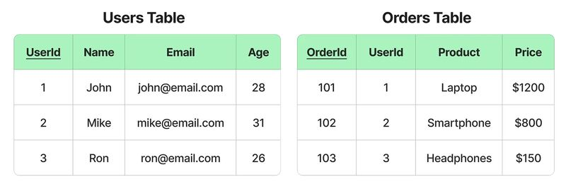
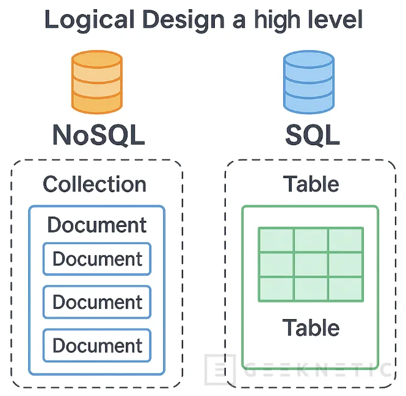
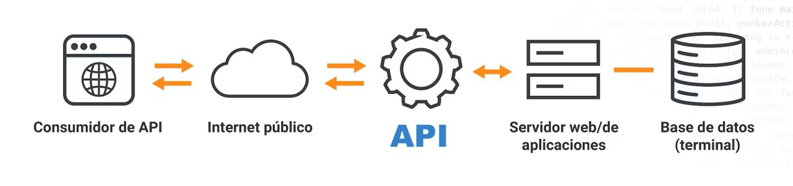
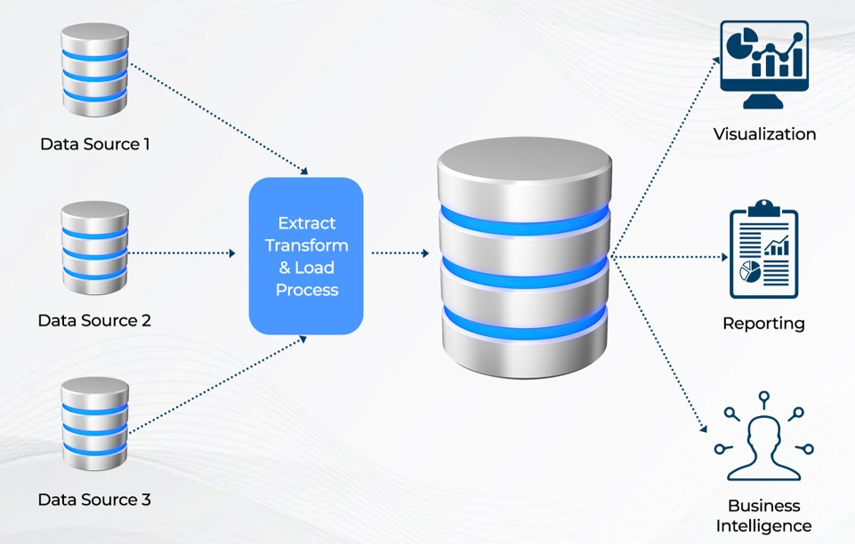
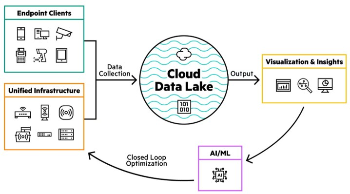

# Introduccion


## Objetivo

Reconocer diferentes **fuentes y sistemas de almacenamiento de datos** e identificar los mecanismos utilizados para acceder a la información que contienen.


## Pregunta

¿Todos los datos se obtienen de la misma manera?


# Fuentes de datos

## ¿De dónde podemos tomar datos?

| Fuente | ¿Qué es? | ¿Cómo accedemos? | 
| ------------- | --------------------------------------------------- | -------------------- | 
| Archivos | Datos almacenados en archivos | Sistema de archivos | 
| Base de datos | Sistema organizado para almacenar y gestionar datos | Consultas / conexión | 
| Página web | Información publicada en la web | HTTP / extracción | | API | Interfaz que proporciona acceso a datos o servicios | Solicitudes HTTP |
| Página web | Información publicada en la web | HTTP / extracción | 
| API | Interfaz que proporciona acceso a datos o servicios | Solicitudes HTTP |
| Data warehouse | Almacenamiento orientado al análisis | Consultas |
| Data lake | Repositorio de grandes volúmenes de datos | Herramientas/plataformas de datos |

## Archivos

Los archivos son una de las formas más simples de almacenar e intercambiar datos.

Pueden contener datos estructurados, semiestructurados o no estructurados utilizando diferentes formatos.

- CSV
- JSON
- Excel
- HTML
- PDF
- Imágenes

## Base de datos

Una base de datos es un sistema diseñado para almacenar, organizar y gestionar datos.

A diferencia de un archivo individual, permite consultar y administrar información de manera eficiente.

Por ejemplo, utilizando **SQL** podemos consultar los datos almacenados:

```sql
SELECT nombre, edad
FROM clientes
WHERE edad > 30;
```

## {.unnumbered}
### Bases de datos relacionales

:::: {.columns}

::: {.column width="40%"}
Las bases de datos relacionales organizan la información principalmente mediante **tablas relacionadas entre sí**.
:::

::: {.column width="60%"}
| Sistema | Descripción |
|---|---|
| [SQLite](https://www.sqlite.org/) | Base de datos local y ligera. |
| [MySQL](https://www.mysql.com/) | Base de datos relacional popular. |
| [PostgreSQL](https://www.postgresql.org/) | Relacional avanzada y extensible. |
| [SQL Server](https://www.microsoft.com/sql-server/) | Plataforma empresarial de Microsoft. |
:::

::::



:::{.figure-source}
Fuente: Frank Kodie — LinkedIn
:::

## {.unnumbered}
### Bases de datos no relacionales

Las bases de datos NoSQL pueden utilizar diferentes modelos para organizar la información.

| Tipo | Descripción | Ejemplo |
|---|---|---|
| **Clave-valor** | Pares de claves y valores. | [Redis](https://redis.io/) |
| **Documentos** | Documentos con estructuras similares a JSON. | [MongoDB](https://www.mongodb.com/) |
| **Columnas** | Datos organizados en familias de columnas. | [Apache Cassandra](https://cassandra.apache.org/) |
| **Grafos** | Nodos y relaciones. | [Neo4j](https://neo4j.com/) |

## {.unnumbered}
### SQL vs. NoSQL

::::{.columns}

:::{.column width="50%"}


:::{.figure-source}
Fuente: Pronetic — Geeknetic
:::
:::

:::{.column width="50%"}

| Bases de datos SQL | Bases de datos NoSQL |
|---|---|
| Modelo relacional | Modelos no relacionales |
| Organizadas en tablas | Diferentes formas de organización |
| Relaciones entre tablas | Estructuras más flexibles |
| Utilizan SQL para consultas | El mecanismo de consulta depende del sistema |
:::

::::

## APIs

Una **API** (**Application Programming Interface**) es una interfaz que permite que diferentes aplicaciones o sistemas se comuniquen entre sí.

Una aplicación puede solicitar información y recibir una respuesta sin necesidad de acceder directamente al sistema donde los datos están almacenados.



:::{.figure-source}
Fuente: Akamai Technologies
:::

## {.unnumbered}
### Acceso a una API

Cada API define **qué información ofrece, cómo solicitarla y cómo estructura sus respuestas**.

También puede establecer:

- Parámetros disponibles.
- Métodos de autenticación.
- Límites o condiciones de acceso.

Por ello, es necesario consultar su **documentación**.

Algunas APIs son públicas; otras requieren autenticación, por ejemplo mediante una **API key**.


## Páginas web

Las páginas web contienen información representada principalmente mediante documentos HTML.

Aunque podemos visualizar esta información en un navegador, también podemos obtener y procesar el documento HTML.

### Web scraping

El **web scraping** consiste en extraer información de una página web a partir de su contenido y estructura.

A diferencia de una API, los datos de una página web **no necesariamente fueron preparados para ser consumidos directamente por otra aplicación**.


## Data warehouse

Un **data warehouse** es un repositorio centralizado que integra y organiza datos provenientes de diferentes fuentes para facilitar su consulta y análisis.

A diferencia del almacenamiento de datos crudos, contiene datos **procesados, limpios y estructurados**, listos para ser utilizados.

{width="70%" fig-align="center"}

:::{.figure-source}
Fuente: LinkedIn
:::


## {.unnumbered}
### Integración de datos

Un **data warehouse** integra información proveniente de diferentes sistemas bajo una **estructura común**.

- Sistema de ventas.
- Sistema de inventarios.
- Base de datos de clientes.
- Sistema financiero.

Esto permite **relacionar y analizar conjuntamente** datos que originalmente se encontraban separados.

## {.unnumbered}
### Consulta de datos
Una vez que los datos se encuentran organizados dentro del data warehouse, normalmente se consultan utilizando **SQL** (**Structured Query Language**).

SQL permite seleccionar, filtrar, agrupar y relacionar los datos almacenados.

```sql
SELECT producto, SUM(total_venta)
FROM ventas
GROUP BY producto;
```

## {.unnumbered}
### Ejemplos

| Data warehouse | Proveedor |
|---|---|
| [**BigQuery**](https://cloud.google.com/bigquery) | Google Cloud |
| [**Amazon Redshift**](https://aws.amazon.com/redshift/) | Amazon Web Services (AWS) |
| [**Snowflake**](https://www.snowflake.com/) | Snowflake |
| [**Azure Synapse Analytics**](https://azure.microsoft.com/products/synapse-analytics/) | Microsoft Azure |
| [**Teradata**](https://www.teradata.com/) | Teradata |


## Data lake

Un **data lake** almacena grandes volúmenes de datos en su **formato original o con poco procesamiento**, sin requerir una estructura previa. Puede contener:

- **Estructurados:** tablas, CSV.
- **Semiestructurados:** JSON, XML, logs.
- **No estructurados:** imágenes, audio, video, documentos.

{width="70%" fig-align="center"}

::: {.figure-source}
Fuente: Hewlett Packard Enterprise (HPE)
:::

## {.unnumbered}
### Acceso a los datos

En un **data lake**, la forma de acceder a los datos depende de su **formato**:

- **CSV / Parquet:** Python, Spark o motores de consulta.
- **JSON / XML:** herramientas que interpreten su estructura.
- **Imágenes, audio y video:** herramientas especializadas.
- **Documentos y texto:** herramientas de procesamiento de texto.

> A diferencia de un **data warehouse**, donde los datos estructurados suelen consultarse mediante **SQL**, un data lake puede requerir distintas herramientas según el tipo de dato.


## Data warehouse vs. data lake

| Data warehouse | Data lake |
|---|---|
| Datos preparados y organizados | Datos crudos o cercanos al original |
| Principalmente estructurados | Estructurados, semiestructurados y no estructurados |
| **Schema-on-write** | **Schema-on-read** |
| Estructura definida antes de almacenar | Estructura aplicada al consultar |
| Consumo principalmente con **SQL** | Consumo según el tipo de datos |
| Orientado al análisis | Orientado al almacenamiento flexible |

> **Warehouse:** datos listos para usar.  
> **Lake:** datos almacenados para procesarlos cuando se necesiten.


<!-- ===================================================== -->
<!-- RESUMEN -->
<!-- ===================================================== -->

# Resumen

- Los datos pueden provenir de **archivos, bases de datos, APIs, páginas web, data warehouses y data lakes**.
- Las **bases de datos** permiten almacenar, organizar y consultar información.
- Las **APIs** permiten acceder a datos y servicios mediante solicitudes.
- El **web scraping** permite extraer información de páginas web.
- Un **data warehouse** integra datos procesados y estructurados para su análisis.
- Un **data lake** almacena datos de distintos tipos y formatos con mayor flexibilidad.
- La forma de **acceder a los datos depende de la fuente y de cómo están almacenados**.


<!-- ===================================================== -->
<!-- REFERENCIAS -->
<!-- ===================================================== -->

# Referencias

::: {#refs}
:::

# Pregunta


{width=50%}


<!-- ===================================================== -->
<!-- LABORATORIO -->
<!-- ===================================================== -->

# Laboratorio

En el laboratorio pondremos en práctica los conceptos vistos en esta lección mediante ejemplos y actividades guiadas.

[**Ir al Notebook →**](https://colab.research.google.com/github/urendacdenisse-hub/ingenieria-de-datos/blob/main/notebooks/unidad-01/notebook-03.ipynb)