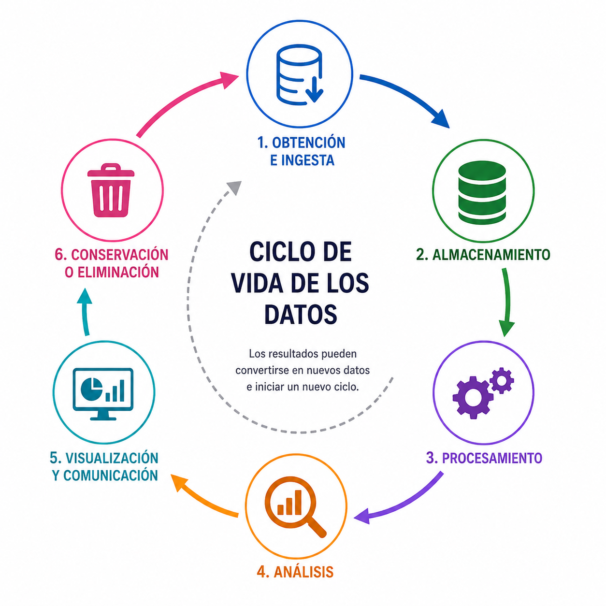

# Introduccion

## Objetivo

Identificar las principales etapas del **ciclo de vida de los datos** y comprender cómo los datos se transforman desde su obtención hasta su conservación o eliminación.

## Pregunta

¿Qué ocurre con los datos desde que son obtenidos hasta que dejan de utilizarse?

## El ciclo de vida de los datos

:::: {.columns}

::: {.column width="45%"}

El **ciclo de vida de los datos** describe las distintas etapas por las que pasan los datos, desde su **obtención** hasta su **conservación o eliminación**.

Durante este ciclo, los datos pueden ser almacenados, procesados, analizados y utilizados para generar nueva información.

:::

::: {.column width="55%"}

{width=100%}

:::

::::

# Obtención y almacenamiento

## Captura de datos

La **captura de datos** consiste en obtener datos desde una fuente.

Los datos pueden provenir de:

- **Personas:** formularios, encuestas, registros o interacciones.
- **Sensores:** temperatura, ubicación, movimiento, imágenes, etc.
- **Aplicaciones y sistemas:** transacciones, actividad de usuarios o registros del sistema.
- **Otros datos:** bases de datos, archivos, APIs o conjuntos de datos existentes.

## Ingesta de datos

La **ingesta de datos** consiste en **transferir o incorporar datos desde una fuente hacia el sistema donde serán utilizados**.

Por ejemplo:

- Leer datos desde un archivo.
- Consultar una base de datos.
- Obtener datos mediante una API.
- Recibir datos generados por sensores o aplicaciones.

> **Captura** = obtener o generar el dato.  
> **Ingesta** = llevarlo al sistema donde será utilizado.

## Almacenamiento

El **almacenamiento** consiste en conservar los datos para que puedan ser utilizados posteriormente.

Los datos pueden almacenarse en:

- **Archivos:** CSV, JSON, Excel, imágenes, etc.
- **Bases de datos:** SQL o NoSQL.
- **Data warehouses:** datos procesados y estructurados para análisis.
- **Data lakes:** grandes volúmenes de datos en su formato original.

> Mantener los **datos originales** permite recuperar su estado inicial cuando sea necesario.

# Procesamiento y análisis

## Procesamiento de datos

El **procesamiento** consiste en preparar y modificar los datos para que puedan ser utilizados.

Puede incluir:

- **Inspección:** conocer su estructura y contenido.
- **Limpieza:** corregir errores, duplicados o valores faltantes.
- **Transformación:** cambiar formatos, unidades o representaciones.
- **Integración:** combinar datos de diferentes fuentes.
- **Selección:** conservar únicamente los datos necesarios.
- **Validación:** verificar que los datos sean correctos y consistentes.

## Análisis de datos

El **análisis de datos** consiste en examinar los datos para **responder preguntas, identificar patrones o resolver problemas**.

Puede incluir:

- **Describir:** ¿qué ocurrió?
- **Comparar:** ¿qué diferencias existen?
- **Relacionar:** ¿cómo se relacionan las variables?
- **Explicar:** ¿por qué ocurrió?
- **Predecir:** ¿qué podría ocurrir?

## Idea clave

Los resultados de un análisis también pueden convertirse en **nuevos datos** y comenzar su propio ciclo de vida.

# Comunicación y conservación

## Comunicación

La **comunicación** consiste en presentar los resultados del análisis de forma que puedan ser **interpretados y utilizados por otras personas**.

Los resultados pueden comunicarse mediante:

- **Tablas y gráficas.**
- **Reportes.**
- **Presentaciones.**
- **Dashboards.**
- **Páginas web.**

> La forma de comunicar los resultados depende del **objetivo y la audiencia**.

## Conservación y eliminación

La **conservación** consiste en mantener los datos mientras puedan ser necesarios para su uso futuro.

El tiempo durante el cual se conservan puede depender de:

- **Utilidad futura:** posibilidad de reutilizar los datos.
- **Privacidad:** protección de información sensible.
- **Almacenamiento:** espacio y costo de conservarlos.
- **Políticas y regulaciones:** requisitos de la organización o legales.

Cuando los datos dejan de ser necesarios, pueden **archivarse o eliminarse**.

# Resumen

- Los datos pasan por **diferentes etapas** durante su ciclo de vida.
- La **captura e ingesta** permiten obtener e incorporar los datos.
- El **almacenamiento y procesamiento** permiten conservarlos y prepararlos.
- El **análisis** transforma los datos en información útil.
- Los resultados pueden **visualizarse y comunicarse**.
- Finalmente, los datos pueden **conservarse o eliminarse**.
- Un resultado generado puede convertirse en un **nuevo dato** e iniciar su propio ciclo.

# Referencias

::: {#refs}
:::

# Pregunta

{width=50%}

# Laboratorio

En el laboratorio seguiremos el **ciclo de vida de un conjunto de datos real**, desde su ingesta hasta su análisis, comunicación y conservación.

[**Ir al Notebook →**](https://colab.research.google.com/github/urendacdenisse-hub/ingenieria-de-datos/blob/main/notebooks/unidad-01/notebook-04.ipynb)