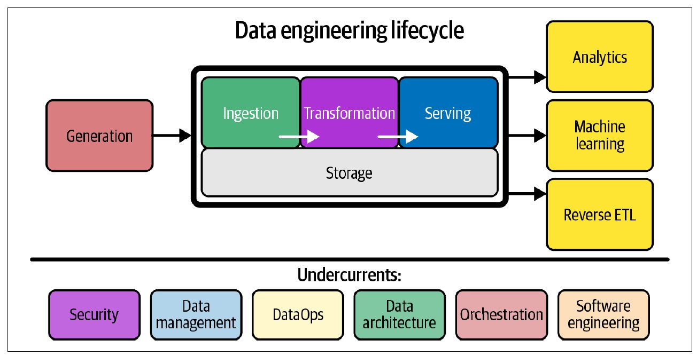

# Introducción

## Objetivo

Identificar los principales **roles relacionados con los datos** y comprender la participación del **ingeniero de datos** dentro del ciclo de vida de los datos.

Reconocer las etapas que conforman el **ciclo de vida de la ingeniería de datos**.

## Pregunta

¿Quiénes participan en el ciclo de vida de los datos y cuál es el papel de la ingeniería de datos?

# Roles relacionados con los datos

## Ingeniero, analista y científico de datos

Diferentes profesionales trabajan con los datos dependiendo del objetivo y la etapa del ciclo.

- **Ingeniero de datos:** construye y mantiene los sistemas que permiten obtener, almacenar, transformar y disponibilizar los datos.
- **Analista de datos:** utiliza los datos para responder preguntas, identificar patrones y comunicar resultados.
- **Científico de datos:** utiliza los datos para realizar análisis, experimentación y desarrollar modelos.

## Participación en el ciclo de vida

| Etapa | Ingeniero de datos | Analista de datos | Científico de datos |
|---|:---:|:---:|:---:|
| Captura | ● |  |  |
| Ingesta | ● |  |  |
| Almacenamiento | ● |  |  |
| Procesamiento | ● | ● | ● |
| Análisis |  | ● | ● |
| Visualización y comunicación |  | ● | ● |
| Conservación y eliminación | ● |  |  |

> La participación de cada rol puede variar dependiendo de la organización y del problema.

## Idea clave

La **ingeniería de datos**, el **análisis de datos** y la **ciencia de datos** son disciplinas diferentes pero complementarias.

La ingeniería de datos se encuentra generalmente **antes del análisis y la ciencia de datos**, proporcionando los datos que estos necesitan para realizar su trabajo.

# Ingeniería de datos

## ¿Qué es la ingeniería de datos?

La **ingeniería de datos** desarrolla y mantiene sistemas y procesos que permiten convertir **datos crudos** en datos **consistentes, accesibles y útiles** para otros usuarios y sistemas.

El ingeniero de datos gestiona este proceso desde que los datos se obtienen de los **sistemas de origen** hasta que están disponibles para ser utilizados.

## Ciclo de vida de la ingeniería de datos

Reis y Housley dividen el **ciclo de vida de la ingeniería de datos** en cinco etapas principales:

1. **Generación**
2. **Almacenamiento**
3. **Ingesta**
4. **Transformación**
5. **Servicio de datos**

## Ciclo de vida de la ingeniería de datos {.unnumbered}

{fig-align="center"}

## Generación

La **generación** ocurre en los sistemas donde se producen originalmente los datos.

Un sistema de origen puede ser, por ejemplo:

- Una aplicación.
- Una base de datos transaccional.
- Un dispositivo IoT.

El ingeniero de datos necesita comprender **cómo se generan los datos** para poder utilizarlos posteriormente.

## Almacenamiento

El **almacenamiento** determina cómo y dónde se guardan los datos.

A diferencia de otras etapas, el almacenamiento puede aparecer en **diferentes puntos del ciclo de ingeniería de datos**.

La forma en que los datos son almacenados influye en cómo podrán ser ingeridos, transformados y utilizados.

## Ingesta

La **ingesta** consiste en obtener los datos desde los sistemas de origen e incorporarlos al sistema de datos.

Esta etapa conecta los **sistemas que generan los datos** con las siguientes etapas del ciclo.

## Transformación

La **transformación** modifica los datos desde su forma original para convertirlos en datos útiles.

Puede incluir operaciones como:

- Conversión de tipos.
- Estandarización de formatos.
- Eliminación de datos incorrectos.
- Normalización.
- Agregación.

## Servicio de datos

El **servicio de datos** consiste en poner los datos preparados a disposición de quienes los necesitan.

Los datos pueden ser utilizados posteriormente para:

- Análisis de datos.
- Reportes y dashboards.
- Machine learning.
- Otros sistemas y aplicaciones.

## Elementos transversales

El ciclo de ingeniería de datos también está acompañado por una serie de elementos **transversales** (*undercurrents*) que intervienen a lo largo de todas sus etapas.

- **Seguridad:** protección de los datos y control de acceso.
- **Gestión de datos:** organización, calidad y gobierno de los datos.
- **DataOps:** automatización, monitoreo y confiabilidad de los procesos.
- **Arquitectura de datos:** diseño y organización de los sistemas de datos.
- **Orquestación:** coordinación de tareas y dependencias.
- **Ingeniería de software:** desarrollo y mantenimiento de los sistemas que procesan datos.

> No son etapas adicionales del ciclo: son prácticas que **dan soporte a todo el ciclo de ingeniería de datos**.

# Resumen

- El **ingeniero, analista y científico de datos** participan en distintas etapas del ciclo de vida de los datos y cumplen funciones complementarias.
- La **ingeniería de datos** construye los sistemas y procesos que permiten convertir datos crudos en datos útiles y disponibles para su consumo.
- El ciclo de vida de la ingeniería de datos comprende **generación, almacenamiento, ingesta, transformación y servicio**.
- El **almacenamiento** puede estar presente en diferentes etapas del ciclo.
- Las etapas no forman una secuencia rígida: pueden **repetirse, superponerse o ejecutarse en diferente orden**.
- **Seguridad, gestión de datos, DataOps, arquitectura, orquestación e ingeniería de software** son elementos transversales que dan soporte a todo el ciclo.
- El objetivo final es **servir datos** que puedan ser utilizados para análisis, machine learning y otros casos de uso.

# Referencias

::: {#refs}
:::

# Pregunta

{width=50%}

