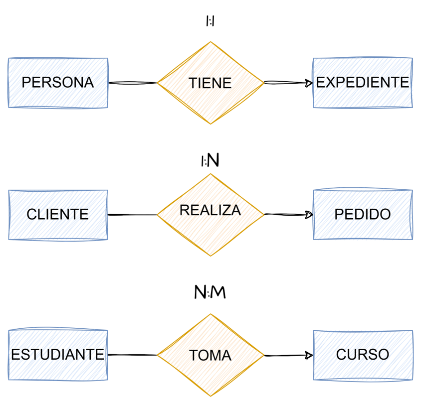
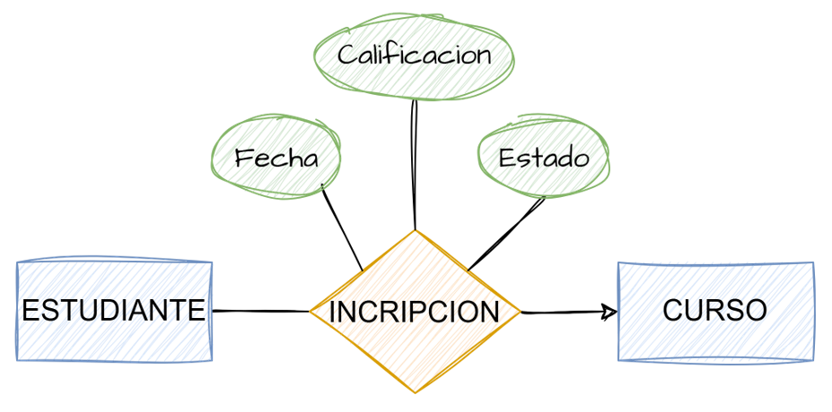
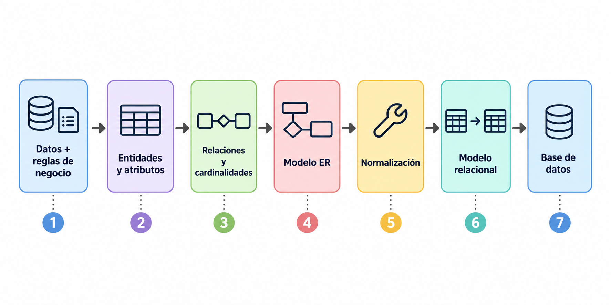

## Representar el negocio

Intentamos crear una representación de la información y las reglas que existen en un negocio.

Queremos convertirlas en una estructura que:

::: {.incremental}
- represente correctamente la información;
- evite redundancia innecesaria;
- mantenga relaciones consistentes;
- permita aplicar las reglas del negocio.
:::

## Diagrama Entidad–Relación

Antes de crear la estructura debemos saber

- ¿Qué cosas existen?
- ¿Qué sabemos de ellas?
- ¿Cómo se relacionan?

El diagrama ER representa estas ideas mediante:

## Entidades

Una **entidad** representa una persona, objeto, lugar, evento o concepto del mundo real que puede **identificarse** y sobre el cual necesitamos **almacenar información**.

Ejemplos:

- Cliente
- Producto
- Empleado
- Proveedor
- Pedido

**Pregunta clave:**

> ¿Sobre qué cosas necesito guardar información?

## Atributos

Un **atributo** representa una característica o propiedad de una entidad que necesitamos **conocer y almacenar** para describirla o identificarla.

- **Cliente:** cliente_id, nombre, correo, domicilio
- **Producto:** producto_id, nombre, precio, categoría

**Pregunta clave:**

> ¿Qué información necesitamos conocer de cada entidad?

## Llave primaria

Cada registro debe poder **identificarse de manera única** dentro de una tabla.

La **llave primaria (Primary Key o PK)** es el atributo, o conjunto de atributos, que permite identificar de manera única cada registro (renglón).

**Cliente**

- `cliente_id` **(PK)**
- nombre
- correo
- domicilio

`cliente_id` permite distinguir a un cliente de todos los demás.

Una **llave primaria** debe ser **única**, no puede ser **nula**, debe identificar un solo registro.

## Relaciones

Las entidades no existen de manera aislada.

Una relación describe **cómo se conectan dos entidades** dentro del negocio.

**Pregunta clave:**

> ¿Cómo se relacionan estas entidades entre sí?

## Cardinalidad

La **cardinalidad** indica **cuántos elementos de una entidad pueden relacionarse con otra**, de acuerdo con las reglas del negocio.

- **One-to-one** (1:1) Cada elemento de una entidad se relaciona con **uno** de la otra.

- **One-to-many** (1:N) Un elemento de una entidad puede relacionarse con **muchos** de la otra.

- **Many-to-many** (N:M) Muchos elementos de una entidad pueden relacionarse con **muchos** de la otra.

**Pregunta clave:**

> Para cada elemento de una entidad, ¿con cuántos elementos de la otra puede relacionarse?

## Cardinalidad {.unlisted}

{width=60% fig-align="center"}

## Relaciones N:M

Una relación N:M normalmente necesita convertirse en una nueva estructura.

{width=60% fig-align="center"}

Además, la relación puede tener sus propios datos.

## Del modelo ER a tablas

El modelo conceptual comienza a convertirse en una base de datos.

**Entidad → Tabla**

**Atributo → Columna**

**Identificador → Primary Key**

**Relación → Foreign Key / tabla asociativa**

## Antes de implementar...

Tenemos:

::: {.incremental}
- **Entidades:** las cosas sobre las que almacenamos información.
- **Atributos:** las características que describen a una entidad.
- **Relaciones:** cómo se conectan las entidades entre sí.
- **Cardinalidades:** cuántos elementos pueden participar en una relación.
:::

::: {.fragment}
Ahora necesitamos preguntarnos:

> **¿La estructura que diseñamos tiene sentido?**
:::

## Normalización

La normalización nos ayuda a revisar nuestro diseño.

Buscamos principalmente:

- evitar información repetida;
- evitar inconsistencias;
- guardar cada dato donde corresponde.

## Primera Forma Normal — 1NF

**Definición formal:**  
El valor de una columna debe ser una entidad atómica, indivisible, excluyendo así las dificultades que podría conllevar el tratamiento de un dato formado de varias partes.

**En palabras simples:**  

- **Un solo valor por celda:** no debemos almacenar listas o múltiples valores juntos.

- **Un valor indivisible:** si necesitas usar sus partes por separado, sepáralas en columnas.

## Primera Forma Normal — 1NF {.unlisted}
### ❌ Incorrecto

**Cliente**

| cliente_id | nombre | teléfonos |
|---|---|---|
| C001 | Ana | 656-111-0000, 656-222-0000 |
| C002 | Luis | 656-333-0000 |

Una celda contiene más de un teléfono.

## Primera Forma Normal — 1NF {.unlisted}
### ✅ Correcto

::: {.columns}

::: {.column width="45%"}

**Cliente**

| cliente_id | nombre |
|---|---|
| C001 | Ana |
| C002 | Luis |

:::

::: {.column width="55%"}

**Teléfono**

| cliente_id | lada | teléfono |
|---|---|---|
| C001 | 656 | 111-0000 |
| C001 | 656 | 222-0000 |
| C002 | 915 | 333-0000 |

:::

:::

Ahora:

- Cada celda contiene **un solo valor**.
- Los datos que necesitamos utilizar por separado, como **lada** y **teléfono**, están almacenados en columnas diferentes.

## Segunda Forma Normal — 2NF

**Definición formal:**  

Una relación se encuentra en **Segunda Forma Normal (2NF)** cuando está en Primera Forma Normal (1NF) y todos los atributos no primos presentan dependencia funcional completa respecto de la llave primaria, es decir, no existen dependencias parciales.

**En palabras simples:**  

- **Primero debe cumplir 1NF.**

- **Si la llave primaria está formada por varias columnas:** los demás atributos deben depender de **toda la llave**, no solamente de una parte.

- **Pregunta clave:** ¿necesito toda la llave para determinar este dato?

## Segunda Forma Normal — 2NF {.unlisted}
### ❌ Incorrecto

**Inscripción**

| estudiante_id | curso_id | estudiante_nombre | curso_nombre | calificación |
|---|---|---|---|---|
| E001 | C101 | Ana | Bases de Datos | 95 |
| E001 | C102 | Ana | Programación | 88 |
| E002 | C101 | Luis | Bases de Datos | 91 |

**Llave primaria:** `(estudiante_id, curso_id)`

## Segunda Forma Normal — 2NF {.unlisted}

- `estudiante_nombre` depende solamente de `estudiante_id`.
- `curso_nombre` depende solamente de `curso_id`.
- `calificación` sí depende de la combinación `estudiante_id + curso_id`.

> Si un atributo depende solamente de **una parte de la llave**, no pertenece aquí.

## Segunda Forma Normal — 2NF {.unlisted}
### ✅ Correcto

::: {.columns}

::: {.column width="50%"}

**Estudiante**

| estudiante_id | nombre |
|---|---|
| E001 | Ana |
| E002 | Luis |

:::

::: {.column width="50%"}

**Curso**

| curso_id | nombre |
|---|---|
| C101 | Bases de Datos |
| C102 | Programación |

:::

:::

::: {.columns style="align-items: center;"}

::: {.column width="50%"}

**Inscripción**

| estudiante_id | curso_id | calificación |
|---|---|---|
| E001 | C101 | 95 |
| E001 | C102 | 88 |
| E002 | C101 | 91 |

:::

::: {.column width="50%" style="text-align: center;"}

Ahora cada atributo depende de **la llave completa de la tabla en la que se encuentra**.

:::

:::

## Tercera Forma Normal — 3NF

**Definición formal:**  

Una relación se encuentra en Tercera Forma Normal (3NF) cuando está en Segunda Forma Normal (2NF) y no contiene dependencias transitivas; es decir, ningún atributo que no forma parte de la llave depende funcionalmente de otro atributo que tampoco forma parte de la llave.

**En palabras simples:**  

- **Primero debe cumplir 2NF.**

- Los atributos deben depender **directamente de la llave**, no de otro atributo.

- **Pregunta clave:** ¿este dato describe directamente a la entidad o describe a otra cosa?

## Tercera Forma Normal — 3NF {.unlisted}
### ❌ Incorrecto

**Empleado**

| empleado_id | nombre | departamento_id | departamento_nombre |
|---|---|---|---|
| E001 | Ana | D01 | Recursos Humanos |
| E002 | Luis | D02 | Ventas |
| E003 | María | D01 | Recursos Humanos |

`departamento_nombre` no depende directamente de `empleado_id`.

Depende de `departamento_id`:

> `empleado_id → departamento_id → departamento_nombre`

Por lo tanto, tenemos una **dependencia transitiva**.

## Tercera Forma Normal — 3NF {.unlisted}
### ✅ Correcto

::: {.columns}

::: {.column width="50%"}

**Empleado**

| empleado_id | nombre | departamento_id |
|---|---|---|
| E001 | Ana | D01 |
| E002 | Luis | D02 |
| E003 | María | D01 |

:::

::: {.column width="50%"}

**Departamento**

| departamento_id | nombre |
|---|---|
| D01 | Recursos Humanos |
| D02 | Ventas |

:::

:::

Ahora cada atributo describe directamente a la entidad a la que pertenece.

`departamento_nombre` depende de `departamento_id`, por lo que se almacena en **Departamento** y no en **Empleado**.

## Las preguntas clave

**1NF**: ¿Cada celda contiene un solo valor y está suficientemente dividido? → Un valor por celda.

**2NF**: ¿Necesito toda la llave para conocer este dato? →Si depende solo de una parte de la llave, **sepáralo**.

**3NF**: ¿Este dato depende de la llave o de otro dato? → Si depende de otro atributo, **probablemente pertenece en otra tabla**.

## La idea importante

No se trata de memorizar reglas.

Se trata de poder preguntar:

1.  ¿Qué entidades existen?
2.  ¿Qué atributos pertenecen a cada una?
3.  ¿Cómo se relacionan?
4.  ¿Cuál es su cardinalidad?
5.  ¿Estoy repitiendo información?
6.  ¿Cada dato está donde realmente corresponde?

## Nuestro proceso

