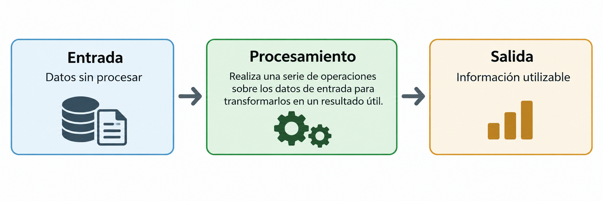
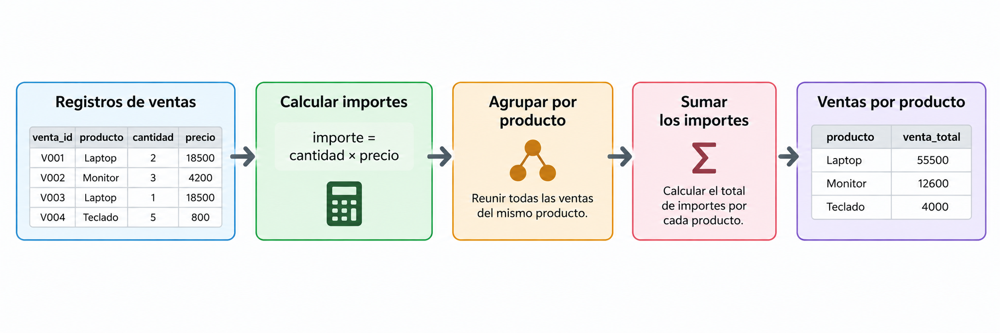
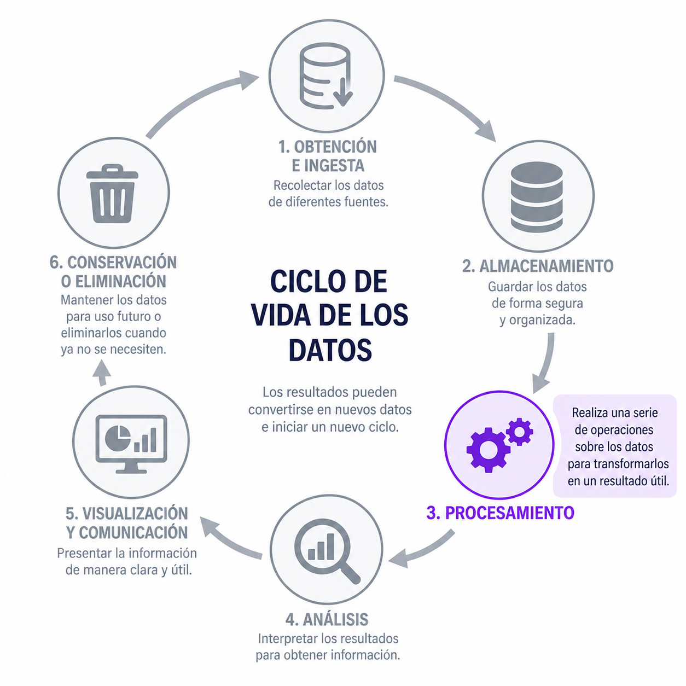
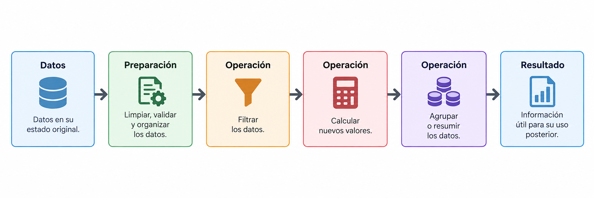
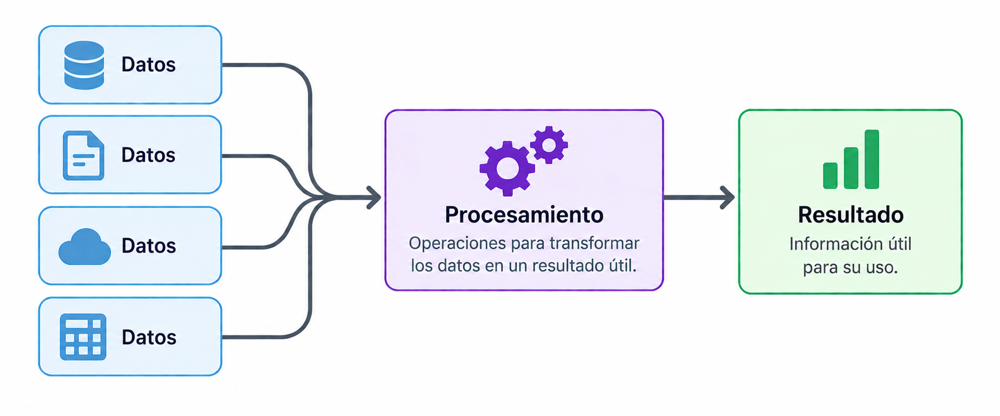
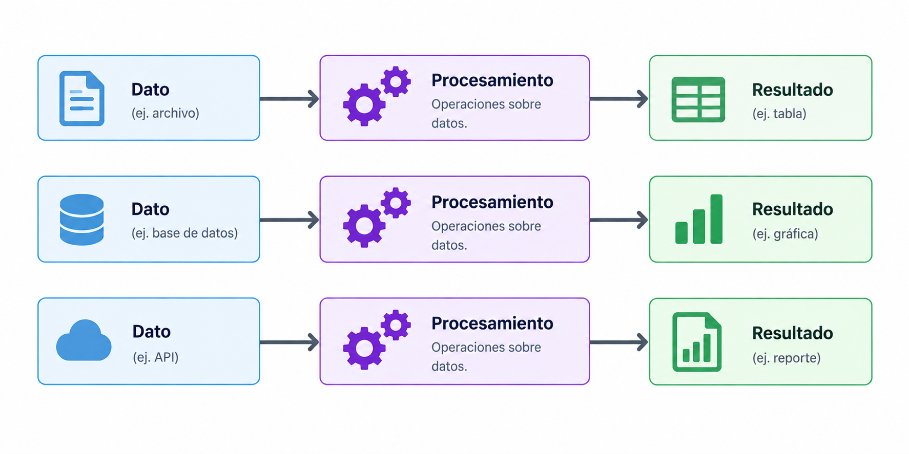

## Datos

Las organizaciones generan y almacenan **grandes cantidades de datos**.

Por ejemplo:

- transacciones;
- ventas;
- registros de clientes;
- sensores;
- aplicaciones;
- páginas web.

Pero tener datos almacenados **no significa que podamos utilizarlos directamente**.

## Datos sin procesar

Los datos en su estado original pueden contener información valiosa.

Sin embargo, esta información puede estar:

- distribuida entre muchos registros;
- en un formato poco conveniente;
- mezclada con información que no necesitamos;
- sin organizar de acuerdo con nuestro objetivo.

Por sí solos, los datos representan principalmente **valor potencial**.

## De datos a información

El **procesamiento de datos** es una serie de operaciones mediante las cuales los **datos sin procesar** se transforman en **información utilizable**.




## Ejemplo

Una empresa registra cada una de sus ventas en una base de datoa:

| venta_id | producto | cantidad | precio |
|---|---|---:|---:|
| V001 | Laptop | 2 | 18500 |
| V002 | Monitor | 3 | 4200 |
| V003 | Laptop | 1 | 18500 |
| V004 | Teclado | 5 | 800 |

Queremos responder

::: {style="text-align: center;"}
**¿Cuánto dinero generó cada producto?**
:::

## Ejemplo {.unlisted}

Para responder la pregunta podemos realizar diferentes operaciones:

1. **Calcular** el importe de cada venta.

$$
\text{importe} = \text{cantidad} \times \text{precio}
$$

2. **Agrupar** las ventas por producto.

3. **Sumar** los importes de cada grupo.


## Ejemplo {.unlisted}

Después del procesamiento obtenemos:

| producto | venta_total |
|---|---:|
| Laptop | 55500 |
| Monitor | 12600 |
| Teclado | 4000 |

La información necesaria estaba contenida en los datos originales.

El procesamiento permitió **obtenerla en una forma útil**.

## Ejemplo {.unlisted}

El procesamiento puede involucrar **varias operaciones consecutivas**, donde el resultado de una operación se convierte en la entrada de la siguiente.




En este caso, los registros individuales se transformaron paso a paso hasta obtener un **resumen de ventas por producto**.

## Operaciones de procesamiento

Dependiendo del resultado que buscamos, podemos realizar diferentes operaciones.

::: {.incremental}

- **Ordenamiento:** ordenar los datos de acuerdo con algún criterio.
- **Filtrado:** seleccionar solamente los datos que cumplen ciertas condiciones.
- **Cálculo:** realizar operaciones matemáticas sobre los datos.
- **Agregación:** resumir información contenida en múltiples registros.

:::

::: {.fragment}
No existe una única forma de procesar los datos. Las operaciones dependen del **resultado que necesitamos obtener**.
:::

## Procesamiento de datos dentro del ciclo

El procesamiento forma parte de un ciclo más amplio:

::: {.columns style="align-items: center;"}

::: {.column width="60%"}



:::

::: {.column width="40%"}

Cada etapa cumple una función diferente dentro del **ciclo de vida de los datos**.

En esta unidad nos enfocaremos en el **procesamiento**, donde los datos son sometidos a diferentes operaciones para transformarlos en **resultados útiles**.

:::

:::

## Procesamiento

Una vez que los datos están disponibles, podemos realizar diferentes operaciones para **transformarlos en un resultado útil**. Sin embargo, antes de realizar el procesamiento principal, los datos pueden necesitar cierta **preparación**.

::: {.incremental}
- corregir o eliminar datos inválidos;
- tratar valores faltantes;
- eliminar duplicados;
- convertir tipos de datos;
- estandarizar formatos.
:::

::: {.fragment}
El objetivo es asegurar que los datos estén en una forma adecuada para las operaciones que realizaremos.
:::

## Procesamiento {.unlisted}

Una vez preparados, podemos aplicar las operaciones necesarias para obtener el resultado deseado.

Por ejemplo:

::: {.incremental}
- **filtrar:** seleccionar los registros que necesitamos;
- **ordenar:** organizar los datos de acuerdo con algún criterio;
- **calcular:** obtener nuevos valores a partir de los existentes;
- **agrupar:** reunir registros que comparten alguna característica;
- **agregar:** obtener resúmenes como sumas, promedios o conteos.
:::

::: {.fragment}
Las operaciones utilizadas dependen del **problema que queremos resolver**.
:::

## Procesamiento {.unlisted}

El procesamiento puede involucrar **varias operaciones consecutivas**.



El resultado de una operación puede convertirse en la **entrada de la siguiente**. No todos los datos requieren las mismas operaciones ni la misma preparación.

## Pipeline de datos

Un **pipeline de datos (Data Pipeline)** es una secuencia organizada de operaciones que permite **mover, procesar y transformar datos** desde una o varias fuentes hasta un destino.

Cada etapa realiza una tarea específica y puede utilizar los **resultados de etapas anteriores**.

Los pipelines permiten organizar el flujo de los datos y **automatizar operaciones que necesitamos ejecutar de manera recurrente**.

## Componentes de un pipeline

Aunque su estructura depende del problema, un pipeline puede incluir:

::: {.incremental}

- **Fuente:** sistema o archivo del que provienen los datos.
- **Ingestión:** incorporación de los datos al flujo de procesamiento.
- **Procesamiento:** operaciones como validación, limpieza, cálculo y transformación.
- **Destino:** sistema donde se almacenan o utilizan los resultados.

:::

::: {.fragment}
No todos los pipelines tienen las mismas etapas ni requieren las mismas tecnologías.
:::

## Ejemplo de un pipeline

Consideremos los datos de la **Semana de Ingeniería**.

Para utilizarlos en un sistema de información, podemos organizar las operaciones de la siguiente manera:

```{mermaid}
flowchart LR
    A["Excel"] --> B["Lectura"]
    B --> C["Validación"]
    C --> D["Limpieza"]
    D --> E["Transformación"]
    E --> F["Base de datos"]
```

Cada etapa cumple una función y el resultado de una operación puede convertirse en la **entrada de la siguiente**.

## ¿Qué ocurre cuando llegan nuevos datos?

Supongamos que recibimos un **nuevo archivo Excel** con información actualizada de las actividades.

¿Tendríamos que repetir manualmente todas las operaciones?

::: {.fragment}
Un pipeline puede permitir que estas operaciones se **ejecuten automáticamente**, aplicando las mismas reglas a los nuevos datos.
:::

Esto facilita mantener la información **actualizada y consistente**.

## ¿Por qué utilizar pipelines?

::: {.incremental}

- **Automatización:** reducir tareas manuales y repetitivas.
- **Reproducibilidad:** aplicar las mismas operaciones bajo las mismas reglas.
- **Mantenimiento:** identificar y modificar etapas específicas.
- **Escalabilidad:** adaptar el procesamiento a diferentes volúmenes de datos.
- **Confiabilidad:** incorporar validaciones y mecanismos para detectar errores.

:::

::: {.fragment}
Sin embargo, **no todos los pipelines necesitan ejecutarse de la misma manera**.
:::

<!--
## Antes de continuar... {.unlisted}

::: {.columns style="align-items: center;"}

::: {.column width="50%"}

:::

::: {.column width="50%"}
Contesta la siguiente encuesta:

[**Responder encuesta**](https://forms.gle/nWyykZBGd1Z28WWb7)
:::

:::
-->

## Pero no todos los datos se procesan igual

Consideremos dos situaciones.

::: {.columns style="align-items: center;"}

::: {.column width="50%"}

### Situación 1

> Una empresa necesita generar al final del día un reporte con todas sus ventas.

Podemos **acumular las ventas** y procesarlas juntas.

:::

::: {.column width="50%"}

### Situación 2

> Un banco necesita determinar si una transacción puede ser fraudulenta.

El resultado debe obtenerse **prácticamente mientras ocurre la transacción**.

:::

:::

## Diferentes necesidades

En el primer caso, los datos pueden **acumularse antes de ser procesados**.




## Diferentes necesidades {.unlisted}

En el segundo, los datos necesitan ser procesados **conforme se generan**.




## Tipos de procesamiento

Estas diferentes necesidades dan lugar a distintas formas de procesar los datos.

En esta unidad estudiaremos principalmente:

::: {.columns}

::: {.column width="50%"}

### Procesamiento por lotes

Los datos se acumulan durante un periodo y posteriormente se **procesan como un conjunto**.

::: {style="text-align: center;"}
**Batch Processing**
:::

:::

::: {.column width="50%"}

### Procesamiento en tiempo real

Los datos se **procesan conforme se generan**, buscando obtener resultados inmediatamente o con muy poca demora.

::: {style="text-align: center;"}
**Real-Time Processing**
:::

:::

:::

## La idea importante

Los datos almacenados contienen **valor potencial**.

El procesamiento permite transformar esos datos en **información utilizable**.

Pero la forma adecuada de procesarlos dependerá de:

> **qué necesitamos obtener y cuándo necesitamos obtenerlo.**

A partir de esta diferencia estudiaremos el **procesamiento por lotes** y el **procesamiento en tiempo real**.