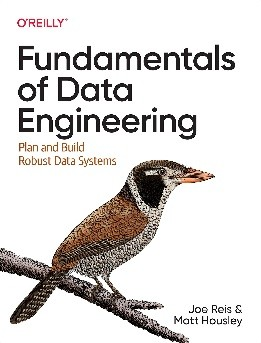
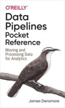

# Información del curso

| **Campo** | **Información** |
|------------|-----------------|
| **Nombre** | Ingeniería de datos |
| **Clave** | CDI-000624 |
| **Semestre** | Agosto – Diciembre 2026 |
| **Créditos** | 8 |
| **Horas** | 4.00 |
| **Grupo** | A, B |
| **Horario** | Martes y jueves 9:00 am – 11:00 am, 11:00 am - 1:00 pm |
| **Lugar** | Salón C-202, C-213|

# Información del instructor

| **Campo** | **Información** |
|------------|-----------------|
| **Nombre** | Dra. Denisse Urenda Castañeda |
| **Correo electrónico** | denisse.urenda@uacj.mx |
| **Asesorías** | En línea, por medio de cita previa |

# Descripción del curso

Este curso introduce los fundamentos de la ingeniería de datos y las principales etapas del ciclo de vida de los datos, desde su adquisición y almacenamiento hasta su transformación, procesamiento y gobernanza. A través de laboratorios y proyectos prácticos, los estudiantes aprenderán a diseñar y construir flujos de datos confiables, reproducibles y escalables utilizando herramientas y tecnologías empleadas en la industria.

# Resultados de aprendizaje

Al finalizar el curso, el estudiante será capaz de:

- Comprender los principios fundamentales de la ingeniería de datos y el ciclo de vida de los datos.

- Diseñar e implementar procesos de adquisición, transformación y almacenamiento de datos. 

- Construir pipelines de datos para el procesamiento por lotes y en tiempo real. 

- Seleccionar tecnologías adecuadas para diferentes necesidades de almacenamiento y procesamiento de datos. 

- Aplicar principios de calidad, gobernanza y seguridad de datos en el diseño de soluciones. 

- Desarrollar soluciones de ingeniería de datos mediante laboratorios y proyectos prácticos.

# Enfoque del curso

Este curso adopta un enfoque de aprendizaje basado en la resolución de problemas. Si bien la comprensión de los fundamentos teóricos es esencial, el objetivo principal es desarrollar la capacidad de aplicarlos para diseñar y construir soluciones de ingeniería de datos. En consecuencia, la evaluación se centra en laboratorios y proyectos prácticos, en lugar de exámenes tradicionales.

# Evaluación del curso

Durante el curso, la evaluación estará basada en laboratorios y proyectos desarrollados a lo largo del semestre. A continuación, se muestra la rúbrica de evaluación.

| **Producto** | **Valor** |
|---------------|----------:|
| Laboratorios (20) | 40% (2% cada uno) |
| Proyectos (5) | 60% (12% cada uno) |
| **Total** | **100%** |
| **Extra** | **5%**   |

## Sobre los laboratorios

Los laboratorios están pensados para realizarse durante la clase, después de introducir un nuevo concepto o tema. Sin embargo, podrán entregarse hasta un día después de haber sido asignados.

## Sobre los proyectos

Los proyectos integran los contenidos de cada unidad y están orientados a la aplicación práctica de los conocimientos adquiridos. La fecha de entrega de cada proyecto corresponderá al domingo de la semana en que concluya la unidad respectiva.

## Sobre el puntaje extra

La asistencia no forma parte de la calificación ordinaria del curso. Sin embargo, como reconocimiento al compromiso y la participación constante, se otorgará un porcentaje adicional sobre la calificación final conforme a los siguientes criterios:

- Asistencia perfecta: +5% sobre la calificación final. 
- Hasta dos faltas o cuatro retardos: +3% sobre la calificación final.

# Cronograma del curso
El siguiente cronograma establece las fechas, los temas, las secciones y las actividades que se abordarán durante el curso.



# Recursos y herramientas del curso

El material del curso estará disponible en el repositorio de [GitHub](https://github.com/urendacdenisse-hub/ingenieria-de-datos), donde se publicarán las presentaciones, laboratorios, conjuntos de datos y recursos complementarios. 

Los laboratorios y proyectos se desarrollarán principalmente utilizando [Google Colab](https://colab.research.google.com/). Cada proyecto deberá entregarse acompañado de un reporte técnico elaborado en [Microsoft Word](https://word.cloud.microsoft/es-mx/), en el que el estudiante documente el problema abordado, la solución propuesta, las decisiones de diseño tomadas y los resultados obtenidos. El objetivo del reporte no es únicamente presentar el funcionamiento de la solución, sino también desarrollar la capacidad de comunicar y justificar decisiones técnicas de manera clara y estructurada.

**Nota**: *No se requiere experiencia previa con Google Colab ni con GitHub. Las herramientas necesarias se introducirán gradualmente conforme avance el curso.*

# Uso de inteligencia artificial

El uso de herramientas de inteligencia artificial generativa (por ejemplo, ChatGPT, Claude, Gemini o GitHub Copilot) está permitido y es alentado como apoyo para el aprendizaje. Sin embargo, estas herramientas deben utilizarse de manera crítica y responsable. **Los estudiantes son responsables de comprender, validar y poder explicar cualquier solución presentada en laboratorios y proyectos.**

# Bibliografía

Durante el curso, los libros enlistados a continuación servirán como material de apoyo para complementar los temas presentados en clase.

:::: {.columns}

::: {.column width="20%"}

[{width=80%}](https://www.oreilly.com/library/view/fundamentals-of-data/9781098108298/)

:::

::: {.column width="80%"}
## Fundamentals of Data Engineering (FDE)

Reis, J., & Housley, M. (2022). *Fundamentals of data engineering: Plan and build robust data systems*. O'Reilly Media. 

:::

::::

:::: {.columns}

::: {.column width="20%"}

[{width=80%}](https://www.oreilly.com/library/view/data-pipelines-pocket/9781492087823/)

:::

::: {.column width="80%"}

## Data Pipelines Pocket Reference (DPPR)

Densmore, J. (2021). *Data pipelines pocket reference: Moving and processing data for analytics*. O'Reilly Media.

:::

::::

